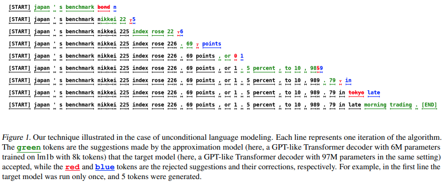

</img>

## Speculative Decoding (wip)

Explorations into some recent techniques surrounding <a href="https://arxiv.org/abs/2211.17192">speculative decoding</a>

Also have a few ideas of my own that I will try and share in this repository, if they work. The goal is to initially use it to speed up the text-to-semantic decoder in <a href="https://github.com/lucidrains/spear-tts-pytorch">Spear-TTS</a>

## Todo

- [ ] figure out batched spec decoding - different rows may advance at different rates
- [ ] test beam search spec decoding, as needed for spear-tts

## Citations

```bibtex
@inproceedings{Leviathan2022FastIF,
    title   = {Fast Inference from Transformers via Speculative Decoding},
    author  = {Yaniv Leviathan and Matan Kalman and Y. Matias},
    booktitle = {International Conference on Machine Learning},
    year    = {2022},
    url     = {https://api.semanticscholar.org/CorpusID:254096365}
}
```

```bibtex
@inproceedings{sun2023spectr,
    title     = {SpecTr: Fast Speculative Decoding via Optimal Transport},
    author    = {Ziteng Sun and Ananda Theertha Suresh and Jae Hun Ro and Ahmad Beirami and Himanshu Jain and Felix Yu and Michael Riley and Sanjiv Kumar},
    booktitle = {Workshop on Efficient Systems for Foundation Models @ ICML2023},
    year      = {2023},
    url       = {https://openreview.net/forum?id=d0mGsaheuT}
}
```

```bibtex
@article{Chen2023AcceleratingLL,
    title     = {Accelerating Large Language Model Decoding with Speculative Sampling},
    author    = {Charlie Chen and Sebastian Borgeaud and Geoffrey Irving and Jean-Baptiste Lespiau and L. Sifre and John M. Jumper},
    journal   = {ArXiv},
    year      = {2023},
    volume    = {abs/2302.01318},
    url       = {https://api.semanticscholar.org/CorpusID:256503945}
}
```

```bibtex
@article{Yan2020ProphetNetPF,
    title   = {ProphetNet: Predicting Future N-gram for Sequence-to-Sequence Pre-training},
    author  = {Yu Yan and Weizhen Qi and Yeyun Gong and Dayiheng Liu and Nan Duan and Jiusheng Chen and Ruofei Zhang and Ming Zhou},
    journal = {ArXiv},
    year    = {2020},
    volume  = {abs/2001.04063},
    url     = {https://api.semanticscholar.org/CorpusID:210164665}
}
```
